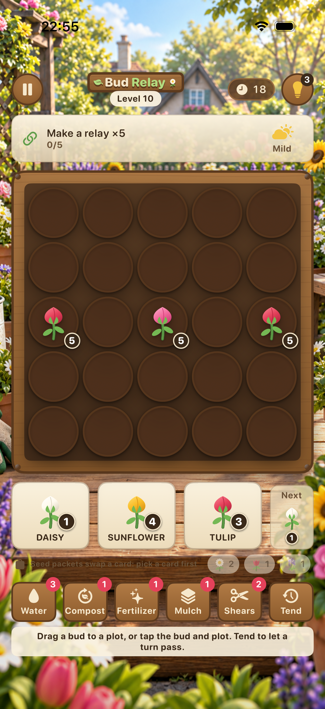
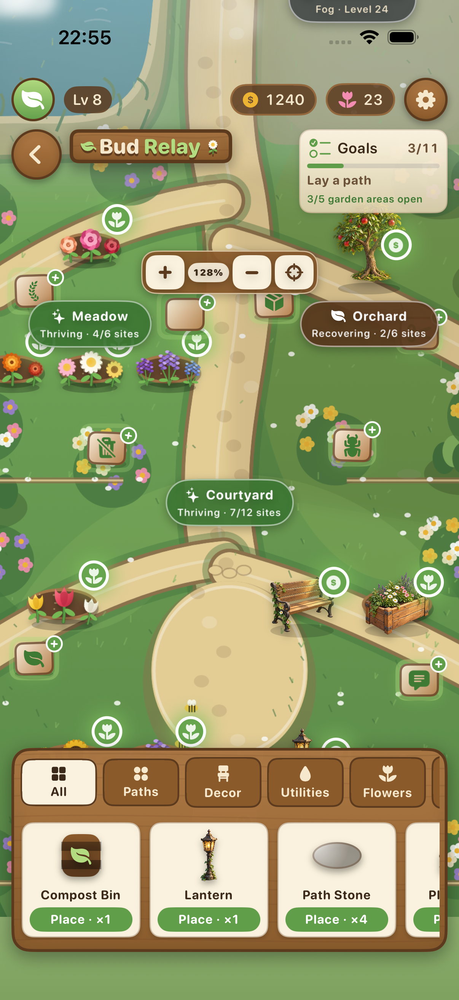
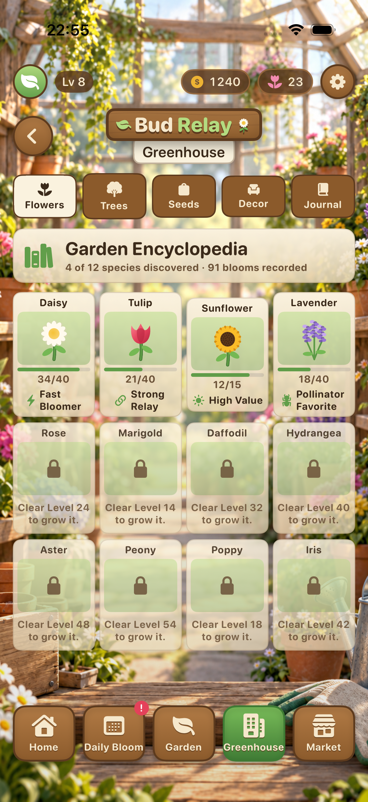
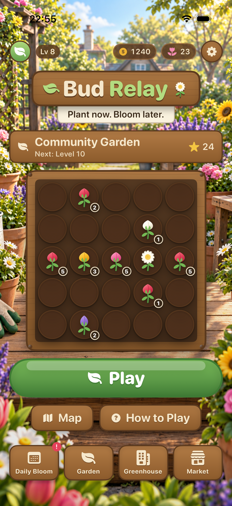
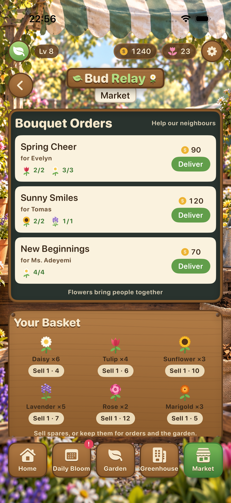
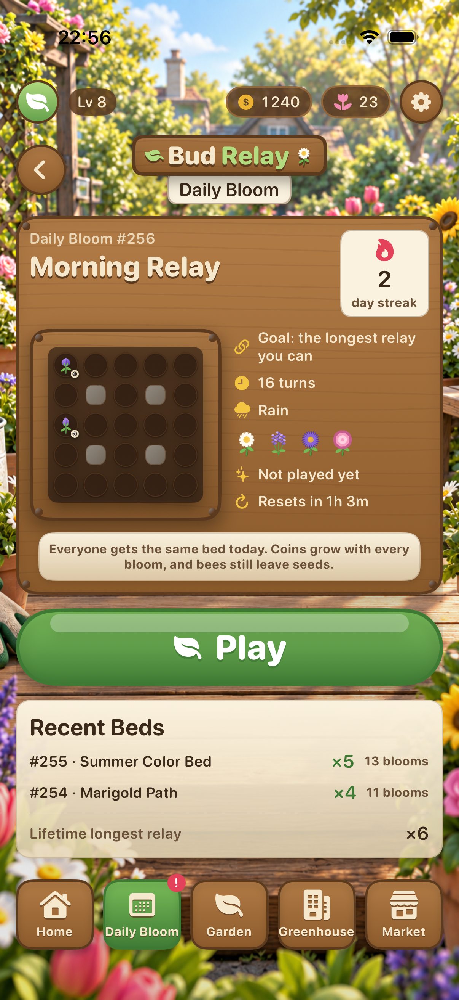
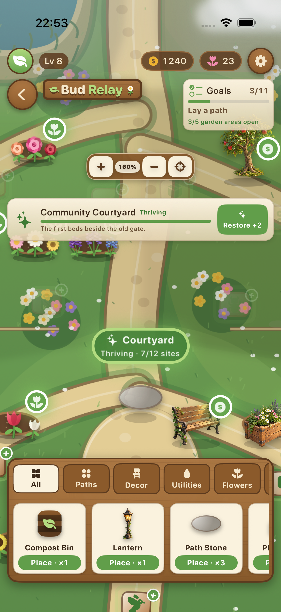
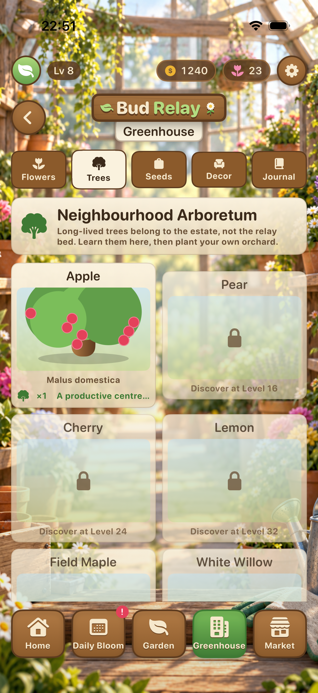
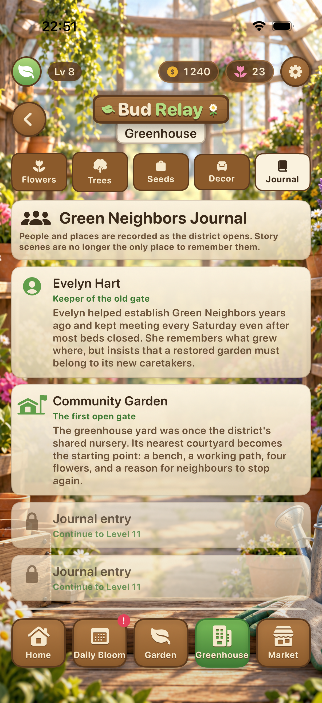

# Bud Relay

**Plant now. Bloom later.**

A relay puzzle about restoring a neighbourhood's gardens. You place buds on a 5×5 bed. Each bud shows how many care cycles it needs. When a flower blooms it hands care to its neighbours, and a bed you planned well opens in one long wave. The flowers you grow fill bouquet orders and decorate a garden that is yours to lay out.

[Player guide](docs/PLAY-GUIDE.md) · [App Store notes](docs/APP-STORE.md)

## Screenshots

| Puzzle | Garden | Greenhouse |
| --- | --- | --- |
|  |  |  |

| Home | Market | Daily Bloom |
| --- | --- | --- |
|  |  |  |

| Garden interactions | Trees | Neighbourhood journal |
| --- | --- | --- |
|  |  |  |

[](#app-target)
[](#build-and-run)
[](#build-and-run)
[](LICENSE)

## Play

One level is one bed:

1. Three buds are in your hand, and you can see the next one.
2. Drag a bud over an empty plot to preview the next bloom and its relay, then release (or tap the bud, then the plot). That is one gardening turn.
3. Every bud counts down by one. Buds at zero bloom.
4. A bloom hands one care point to each neighbouring bud (tulips hand two). Buds that reach zero bloom too, and pass it on.
5. After its stay, a bloom is harvested and the plot is free again. Marigolds and asters stay two turns; most flowers stay one.

The number you see is the number you get. No hidden multipliers.

The whole game is one question: **take a small relay now, or spend a turn setting up a big one?**

## Flowers

| Flower | Cycles | Trait |
| --- | --- | --- |
| **Daisy** | 1 | Blooms the turn it is planted. The trigger. |
| **Tulip** | 3 | Hands two care points to every neighbour. |
| **Lavender** | 3 | Blooming with daisies or sunflowers brings bees, and bees leave seed packets. |
| **Marigold** | 3 | Its bloom lingers two turns and keeps nearby soil from drying. |
| **Sunflower** | 4 | Slow, and the market pays well. |
| **Rose** | 5 | Slower still. Florists ask for it by name. |
| **Daffodil** | 2 | A quick spring bloom that fits between the daisy and tulip. |
| **Hydrangea** | 4 | Relays to all eight surrounding plots, including diagonals. |
| **Aster** | 4 | A two-turn, pollinator-friendly late bloom. |
| **Peony** | 6 | The slowest flower, but each harvest adds two stems. |
| **Poppy** | 2 | A quick meadow flower that joins pollinator relays. |
| **Iris** | 4 | A measured late-game flower with a two-point relay. |

A relay chain is a connected group of flowers that bloom in the same turn. Relays of ×3, ×5, and ×8 earn one, two, and three flowers for your basket.
At ×4 and above, a Bloom Echo scatters petals across the bed and sends permanent restoration care to the garden's most neglected open area.

## Tools

Tools never cost a turn.

- **Watering can** soaks a plot and its neighbours. On hot days soil dries a step each turn, and a bud on dry soil waits.
- **Compost** enriches an empty plot; the next bud there starts a turn closer to bloom.
- **Fertilizer** adds one extra flower to a bud's harvest.
- **Mulch** keeps a plot from drying for the rest of the level.
- **Shears** remove a plant. You lose its flower.

Seed packets swap a card in your hand for the flower you actually need.

## The district

Sixty levels across six chapters, each a place the Green Neighbors are bringing back:

1. **Community Garden** — learn the relay
2. **Rooftop Garden** — tight planters, thin soil, hot days
3. **Schoolyard Garden** — grow a mix, bring the bees
4. **Greenhouse Market** — roses, harvest goals, fertilizer
5. **Lakeside Park** — rain one day, heat the next
6. **Old Botanical Garden** — the longest relays

Goals change from level to level: bloom a count, make a relay of a given length, grow specific flowers, bring bee visits, collect a harvest, or finish with plots to spare. Each level has a turn budget. Miss it and you retry at once. No lives, no timers.

Some beds come with buds already planted. Those are the levels where a relay of seven or eight is on the table, if you connect them at the right moment.

## After the level

- **Garden Estate** — five connected areas replace the single field: Community Courtyard, Wildflower Meadow, Neighbourhood Orchard, Pond Garden, and Greenhouse Yard. Districts emerge from fog at later levels, begin polluted, recover as you work, and add new authored terrain sites over time. The terrain, pond, paths, flowers, fog, and interactive objects now share one camera-controlled world, so zooming cannot detach a placement from its landscape.
- **Market** — bouquet orders from named neighbours, seed packets, supplies, and decor.
- **Greenhouse** — a twelve-flower encyclopedia, six-tree arboretum, and persistent Green Neighbors journal. Entries record game rules, scientific name, family, season, home range, garden use, care notes, field facts, bloom count, and cosmetic varieties.
- **Daily Bloom** — one shared bed a day, seeded from the date. The goal is the longest relay you can manage. Streaks are tracked locally.

Twenty-four short level story scenes, garden milestones, and twelve persistent lore entries build the district without cutscenes or saving the world.

## App target

- iPhone and iPad (universal)
- iOS 18+
- Portrait on iPhone; portrait and landscape on iPad
- No account, no ads, no analytics, no network

Bundle ID: `com.sergiiziborov.budrelay`

## Build and run

```bash
brew install xcodegen   # if needed
cd bud-relay
xcodegen generate
open BudRelay.xcodeproj
```

Select an iPhone or iPad simulator, then Run.

Unit tests cover the relay resolver, the bag dealer, harvest timing, weather, rewards, garden goals, persistence, and a two-ply bot that must be able to clear every level in the catalog:

```bash
xcodebuild test \
  -scheme BudRelay \
  -destination 'platform=iOS Simulator,id=<SIMULATOR_UDID>'
```

The app icon is drawn by `scripts/make-icon.py`. Flowers, boards, and the camera-controlled estate terrain are drawn in SwiftUI; other scene backgrounds and key transparent garden decorations live in the asset catalog.

## Project layout

```
BudRelay/
  App/              # scene, navigation, progress, rewards
  Game/Engine/      # flowers, board, relay resolver, draft, levels, bot, daily
  Game/Art/         # procedural flowers, plots, the wooden bed
  Meta/             # garden, market orders, story scenes
  Features/         # home, play, result, map, garden, greenhouse, market, daily, settings, how to play
  Persistence/      # progress state and store
  DesignSystem/     # palette, wood and paper panels, buttons, backdrop
  Resources/        # asset catalog, privacy manifest
```

## Why this shape

The puzzle is the centre of the game, and the estate is the reason to come back. Garden activities and productive items can supply coins, seeds, flowers, and tools, while long puzzle relays restore the estate through Bloom Echo. The relay itself stays readable: twelve distinct flowers, one 5×5 puzzle board, and rules you can read off the screen.

## License

MIT. See [LICENSE](LICENSE). Privacy notes live in [PRIVACY.md](PRIVACY.md).
